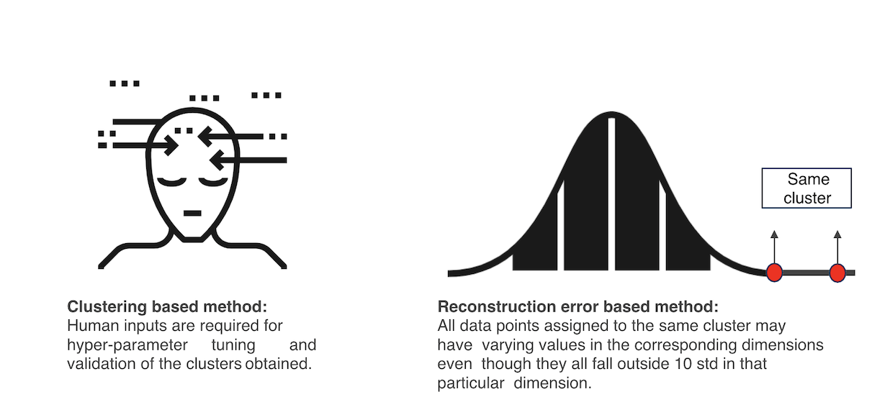

# Anamoly detection using server log data

## Introduction

During my internship, I worked on detecting anamolous servers using server log data. While working on this porject I researched extensively on various anamoly detection / novelty detection techniques. While not giving away an confidential data I will summarize the methodology that I followed to detect anamolies.

## Anamoly detection in servers

Servers can behave abnormally due to many reasons:
* software failures 
* hardware (e.g., some piece of hardware simply breaks down) 
* offered load (an exceptionally high load is offered to the system)
* human errors (e.g., configuration errors). 

Various algorithms were looked into to design an anomaly detection system.

__Assumptions:The model was built assuming the normal operating state of the server is unknown to set thresholds for various parameters.__

## Data
The data contains information of various attributes such as temperature, memory, cpu usage etc. The time dependent data points are obtained at very high frequencies.

## Objective
Research methods to identify the different operational states of  a server utilizing the telemetry data from the server  instrumentation.

## Task
Utilize	Clustering	and	Reconstruction	Error	based	Machine
Learning methods to identify different operational states.

The task can be broken down into the following sub-tasks:
* Identify the normal operating state of the server
* Identify the threshold levels for various attributes
* Identity the different abnormal states the server has been in and a method to automatically identify the new abnormal states 
when they come up.
* propose a way to identify a change in the normal operating state of the system, i.e. a way to identify the new normal.

## Potential Impacts:
* Automate identification: Automatically identify when the  inherent operational state of the server changes.
* Identify sub optimal states: Compare the operating states  obtained for different servers to draw insights to identify sub  optimal hardware, software and environmental conditions.
* Optimal job scheduling: Identify the operating states of a  server under workload and advice orchestrators and job  schedulers in order to optimize the workload execution.
* Accurate billing: Map operating states with job scheduling  information in order to charge customers based on the  amount of resources used and not just based on the time for  which a job is run.

## Approach
**1) Cluster the data to obtain different operating states of the server.Mean shift clustering and DB Scan were chosen.Clustering was performed in 2 rounds.**

Different clustering techniques were explored. Of the standard clustering algorithms available, the algorithms which did not require number of clusters as input (for which  domain knowledge is required), which could identify clusters of different shapes, which would scale well for large data sets, and  which did not make strong assumptions about the distributions of the clusters were selected. Mean Shift and DBSCAN were two  such algorithms.

The reason for not using DBSCAN for round 1 clustering is, DBSCAN has a hyper-parameter eps which has a range of (0, infinity), making identifying the right value for the hyper-parameter a non trivial job and also DBSCAN cannot make predictions on new  data obtained. Mean Shift clustering algorithm has a hyper-parameter called bandwidth, which again has a hyper-parameter  called quantile. The range of this hyper-parameter is [0,1] making it relatively easier to tune it and also Mean Shift clustering  algorithm can make predictions on the new data obtained.

Distances between the clusters obtained after round 1 clustering were calculated and DBSCAN is used to merge similar clusters.  The range of the hyperparameter eps, in this case, is [0,2] as cosine similarity varies between [-1,1] and distance which is equal  to 1-similarity varies between [0,2].

Clustering in one go was tried, but the clusters then obtained were highly similar. Hence two rounds of clustering was  performed.

So for any new data point that is obtained, prediction was made using Mean shift clustering and it is then assigned to its corresponding cluster according to DB Scan.

**2) Threshold based method. Reconstruction error is used to set thresholds and indentify anomalies, the anomalies are then classified into different categories.**

Meanchift clustering was used with it's quantile set to a small value i.e. 0.01. This ensured that only very similar data points were clustered together. Of the clusters obtained the largest one was selected and and autoencoder was trained on it. The reconstruction error obtained was less for similar data points and was significantly large for dissimilar ones. The similar ones were clustered together and thresholds were set based on the mean and std of this cluster. The dissimilar points were analysed and were assigned to the cluster which has the corresponding abnormal covariate.

New data point obtained can directly be compared with the threshold values and can be assigned to it's corresponding cluster.

## Evaluation criterion for the 2 models.
The results obtained by the clustering algorithms were evaluated using silhouette score and by reclustering with different initializations. RMSE was used to build the autoencoder. 

## Shortcomings of the models 

